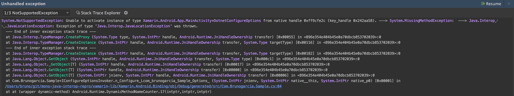

Repro for binding Android library issue



The following Java code is not callable from C#:

```java
public static void doSomething(ConfigureOptions callback) {
        Options o = new Options();
        callback.configure(o);
    }
    public interface ConfigureOptions {
        void configure(Options options);
    }
}
```

It is callable from Java (with 1.8 compat) as:

```java
public static void callDoSomething() {
    doSomething(o -> Log.d(TAG, o.getValue()));
}
```

The C# binding calling out the Java method without parameters works just fine.
Calling the one with while passing the argument, fails:

```csharp
public class DotnetConfigureOptions :
    Java.Lang.Object,
    Com.Brunogarcia.Sample.IConfigureOptions
{
    public void Dispose() { }
    public IntPtr Handle { get; }
    public void Configure(Com.Brunogarcia.Sample.Options options) => 
        Log.Debug("dotnet", options.GetType().Name);
}

Com.Brunogarcia.Sample.CallDoSomething();
// Throws here:
Com.Brunogarcia.Sample.DoSomething(new DotnetConfigureOptions());
```